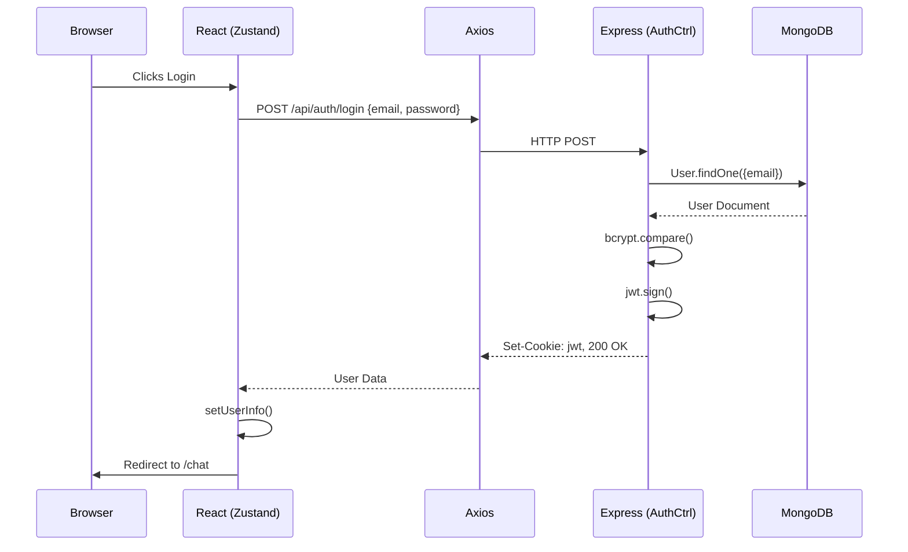
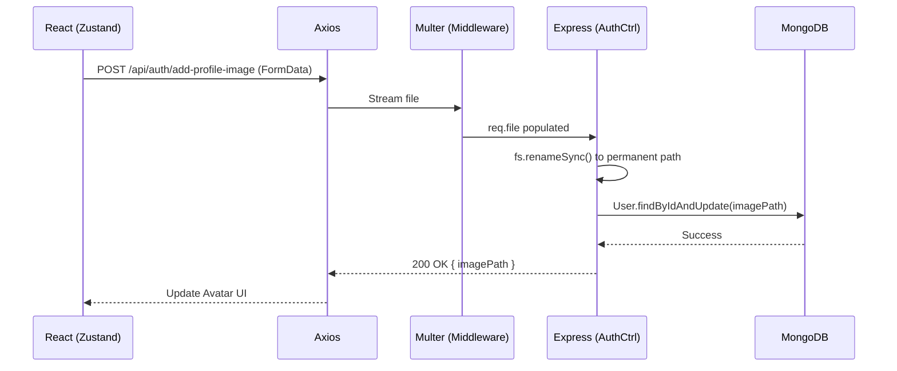
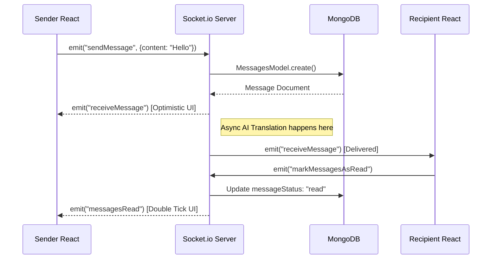
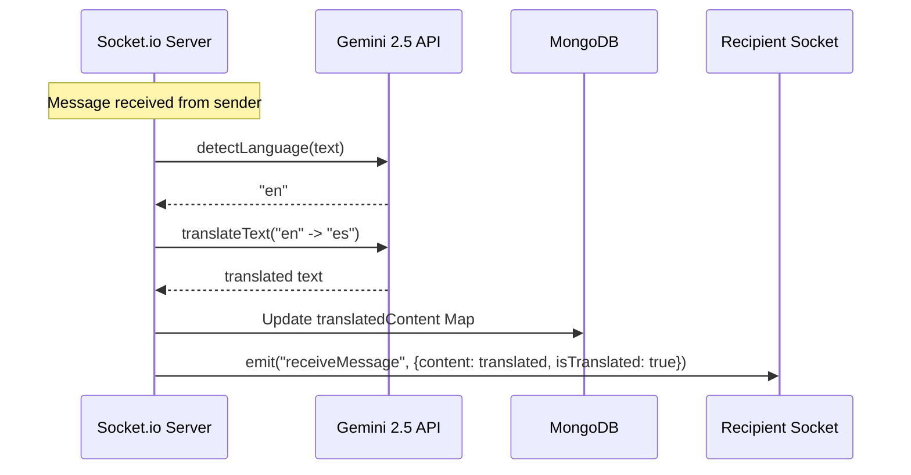
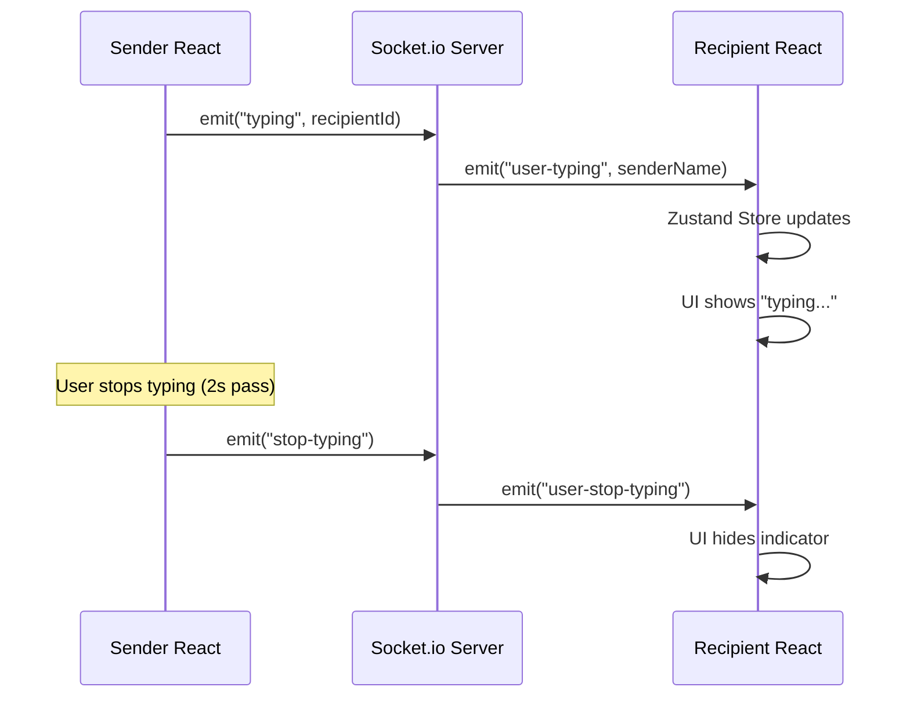

# PolyChat: Features and Workflow

This document details the exact lifecycle, purpose, and logic of every major feature in the PolyChat application.

> *Related Documents:*
> - [Project Architecture](file:///e:/Projects/PolyChat/Docs/PROJECT_ARCHITECTURE.md)
> - [Frontend Documentation](file:///e:/Projects/PolyChat/Docs/FRONTEND_DOCUMENTATION.md)
> - [Backend Documentation](file:///e:/Projects/PolyChat/Docs/BACKEND_DOCUMENTATION.md)

---

## Table of Contents

1. [Authentication (Register, Login, Logout)](#1-authentication-register-login-logout)
2. [Profile Management & Setup](#2-profile-management--setup)
3. [User Search & Friend System](#3-user-search--friend-system)
4. [Direct Messaging (Text & Files)](#4-direct-messaging-text--files)
5. [AI Translation & Preferred Language](#5-ai-translation--preferred-language)
6. [Real-time Presence (Online Status & Typing)](#6-real-time-presence-online-status--typing)

---

## 1. Authentication (Register, Login, Logout)

**Purpose**: Secure the application and establish user identity and session persistence.

- **User Flow**: User enters email/password. On success, they are routed to `/profile` (if new) or `/chat` (if returning).
- **Backend Flow**: `AuthController` receives credentials, validates/hashes with `bcryptjs`, signs a JWT, and sets a 3-day secure HTTP cookie.
- **Database**: `UserModel.create()` or `UserModel.findOne()`.
- **API**: `POST /api/auth/signup`, `POST /api/auth/login`.

> **Developer Note:** The `jwt` cookie is intentionally *not* HttpOnly so that client-side logic can detect its presence if absolutely necessary, though standard validation occurs via the `/api/auth/user-info` boot check.

---

## 2. Profile Management & Setup

**Purpose**: Personalize user identity with Avatars, Colors, and Preferred Language.

- **Frontend Flow**: User uploads an image. React uses `FormData` and Axios POSTs it. Zustand updates the local state on 200 OK.
- **Backend Flow**: `multer` middleware intercepts the file. `AuthController` moves it from a temp hash to `uploads/profiles/timestamp.ext`.
- **API**: `POST /api/auth/update-profile`, `POST /api/auth/add-profile-image`.

---

## 3. User Search & Friend System

**Purpose**: Discover Contacts and manage friend requests.

- **Frontend Flow**: Debounced search input triggers Axios. Results are mapped with contextual buttons (Add, Pending, Friends).
- **Backend Flow**: `ContactsController.searchContacts` runs a case-insensitive regex search. It cross-references the current user's `friends` and `friendRequests` arrays to inject relationship status into the response.
- **API**: `POST /api/contacts/search`, `POST /api/contacts/friend-request/send`.

> **Developer Note (Security):** The regex search explicitly escapes special characters to prevent ReDoS (Regular Expression Denial of Service) attacks by malicious search strings.

---

## 4. Direct Messaging (Text & Files)

**Purpose**: Real-time bi-directional messaging with Optimistic UI updates.

- **Frontend Flow**: User types in `MessageBar` and hits Send. `socket.emit("sendMessage")` fires.
- **Backend Flow**: `socket.js` intercepts, saves to MongoDB, emits immediately back to the sender (Optimistic Update), initiates AI translation asynchronously, and finally emits to the recipient.
- **Socket Events**: `sendMessage`, `receiveMessage`, `markMessagesAsRead`.

---

## 5. AI Translation & Preferred Language

**Purpose**: Transparently break language barriers without requiring manual user intervention.

- **Logic Flow**: Text messages are intercepted by the server. If the sender's language differs from the recipient's Preferred Language, Gemini 2.5 Flash detects the source language and translates it.
- **Database**: Translations are cached in the `translatedContent` Map on the Message document to avoid re-translating historical messages.

> **Developer Note (Edge Case):** If the Gemini API hits a rate limit (HTTP 429), the `translationService` sets an in-memory `apiQuotaExceeded` flag. For the next hour, it bypasses the API and simply delivers the original untranslated text to ensure chat functionality doesn't break.

---

## 6. Real-time Presence (Online Status & Typing)

**Purpose**: Provide live interaction feedback.

- **Online Status**: Handled by tracking socket connection events. The server maintains a `userSocketMap`. On connect/disconnect, it broadcasts `user-status-change`.
- **Typing**: `MessageBar` emits `typing` on keystrokes. Debounced by 2 seconds to emit `stop-typing`.

> **UI Integration Note:** The presence features, auth screens, and profile setups are designed to seamlessly adapt to both mobile and desktop viewports, with pixel-perfect Flexbox alignment and a cohesive dark/light mode toggle that cascades through all modals, sidebars, and chat states.

---
*Generated: 2026-07-20 | PolyChat Features & Workflow v1.2*
