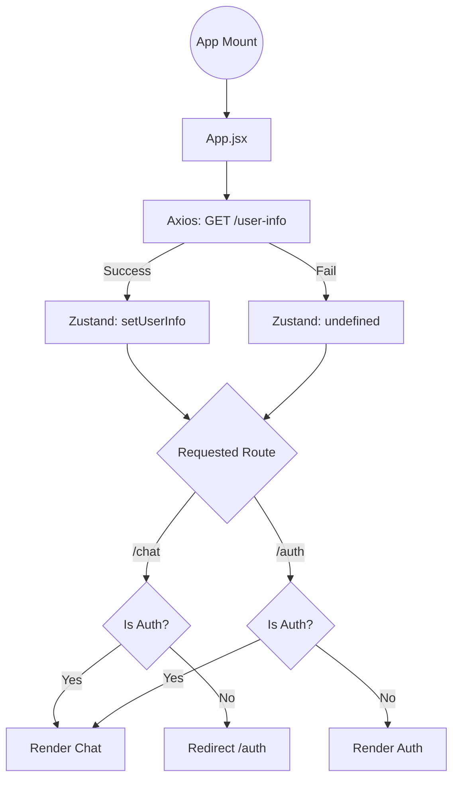
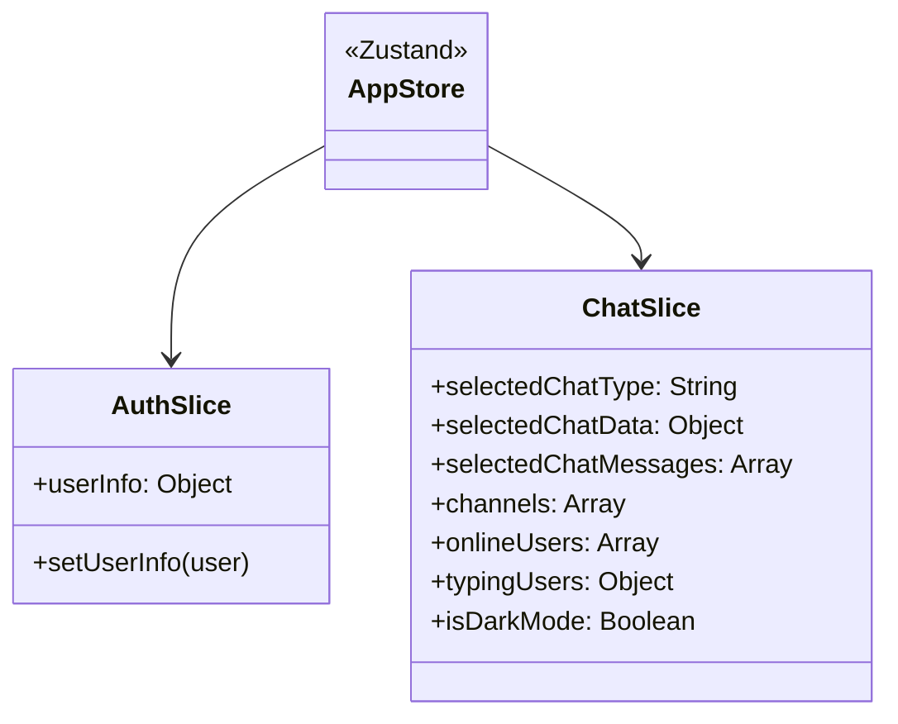

# PolyChat Frontend Documentation

This document serves as the official frontend documentation for the PolyChat application. It provides an in-depth explanation of the client-side architecture, modules, and workflows.

> *Related Documents:*
> - [Project Architecture](file:///e:/Projects/PolyChat/Docs/PROJECT_ARCHITECTURE.md)
> - [Features and Workflow](file:///e:/Projects/PolyChat/Docs/FEATURES_AND_WORKFLOW.md)

---

## Table of Contents

1. [Frontend Overview](#1-frontend-overview)
2. [Folder Structure](#2-folder-structure)
3. [Routing Structure](#3-routing-structure)
4. [Layout & Responsive Design](#4-layout--responsive-design)
5. [Components](#5-components)
6. [State Management (Zustand)](#6-state-management-zustand)
7. [API & Socket Layer](#7-api--socket-layer)
8. [Developer Notes & Design Decisions](#8-developer-notes--design-decisions)
9. [Future Improvements](#9-future-improvements)

---

## 1. Frontend Overview

The PolyChat frontend is a robust Single-Page Application (SPA) designed to deliver a native-like real-time chat experience. It handles complex operations such as bi-directional WebSocket communication, real-time message rendering, dynamic UI updates based on translation states, and progressive file uploads. 

The interface utilizes **TailwindCSS** for utility-first styling and **Framer Motion** for micro-animations, adhering to a modern, glassmorphic, mobile-first design language.

## 2. Folder Structure

The `client/src` directory is strictly organized by feature and function:

| Directory | Purpose |
|---|---|
| `assets/` | Static assets like Lottie JSON animation files and SVGs. |
| `components/` | Shared global components (e.g., `ContactList`). |
| `components/ui/` | Radix UI and shadcn wrapped primitive components (Buttons, Avatars). |
| `context/` | React Context providers, specifically the `SocketContext`. |
| `lib/` | Core libraries: `api-client.js` (Axios) and `utils.js` (Tailwind merge). |
| `Pages/` | Route-level Page components: `/auth`, `/profile`, and `/chat`. |
| `store/` | Zustand global store configuration and individual slices. |
| `utils/` | Global constants (`routes`) and static helper arrays (`languages`). |

## 3. Routing Structure

The application uses `BrowserRouter` (React Router v7) with strict route guards to prevent unauthenticated access.

## 4. Layout & Responsive Design

The frontend strictly adheres to a **mobile-first philosophy** using Tailwind breakpoints.

- **Layout Shell:** Uses CSS Flexbox with a fixed `h-screen` and `overflow-hidden`. Scrolling is strictly delegated to specific inner components (like the message history).
- **Mobile (`< 768px`):** The UI displays one panel at a time. The sidebar takes full width (`w-full`). When a chat is selected, the sidebar hides and the Chat Container takes over.
- **Desktop (`>= 768px`):** A dual-pane layout. The sidebar occupies a fixed percentage (`md:w-[35vw] xl:w-[20vw]`), and the Chat Container flex-grows to fill the rest.

### Theme (Dark Mode)
Dark mode relies on a `.dark` class toggled on the `document.body`. Zustand persists the `isDarkMode` boolean to `localStorage`. Components utilize Tailwind's `dark:` variant (e.g., `bg-white dark:bg-slate-900`) for seamless theme switching.

## 5. Components

### Page-Level Components
| Component | Responsibility |
|---|---|
| **Auth** | Manages Login/Signup tabs, triggers Axios calls, and handles the entrance Lottie animation. |
| **Profile** | Forced intermediate step for new users. Captures Avatar uploads (FormData), Name, Color, and Preferred Language. |
| **Chat** | The primary shell. Mounts `ContactsContainer`, and either `ChatContainer` or `EmptyChatContainer`. |

### Chat Sub-Components
| Component | Responsibility |
|---|---|
| **ContactsContainer** | The sidebar. Contains the New DM search, Channel creation dialog, and `ContactList` for active chats. |
| **ContactList** | Reusable UI for mapping arrays of Contacts or Channels. Displays Avatars and online status (green dots). |
| **ChatHeader** | Top bar of the active chat. Displays recipient info, real-time typing indicators, and the Dark Mode toggle. |
| **MessageContainer** | The scrolling history view. Groups messages by date, aligns them left/right, and renders the "Translated" badge. |
| **MessageBar** | The input zone. Houses the text area, file attachment Multer trigger, Emoji picker, and emits typing events. |

## 6. State Management (Zustand)

Zustand is utilized for global state, intentionally chosen over Redux to eliminate boilerplate and allow highly performant, direct state mutations.

### Store Architecture

> **Developer Note:** The store is entirely reactive. When `SocketContext` receives a message, it calls `addMessage()`. This immediately updates `selectedChatMessages`, causing `MessageContainer` to re-render instantly without requiring prop-drilling from the parent `Chat` component.

## 7. API & Socket Layer

### API (Axios)
All HTTP communication utilizes an Axios instance (`src/lib/api-client.js`).
- **Configuration:** Configured with `withCredentials: true` to ensure the secure HTTP-only JWT cookie is transmitted to the backend automatically.
- **Error Handling:** Async functions are wrapped in `try/catch`. Failures trigger `toast.error()` via the Sonner library for elegant UI feedback.

### WebSocket (Socket.io)
The `SocketContext.jsx` file acts as the bridge between the backend Socket.io server and the frontend Zustand store.

1. **Connection:** Instantiated automatically when `userInfo` populates.
2. **Listeners:** Listens for `receiveMessage`, `user-typing`, `online-users`.
3. **Dispatch:** Triggers Zustand actions (e.g., `addMessage`) upon receiving socket events.

## 8. Developer Notes & Design Decisions

- **Why Vite?** Vite provides near-instant Hot Module Replacement (HMR). Compared to Create React App (Webpack), Vite drastically reduces local development boot times.
- **Why Radix UI?** Building accessible dropdowns and modals from scratch is error-prone. Radix UI (via shadcn) provides unstyled, screen-reader accessible primitives that we style perfectly with Tailwind.
- **Loading States:** Heavy file uploads freeze the UI with a Framer Motion overlay. This is intentional to prevent the user from navigating away or sending subsequent messages while a massive file buffer is transferring.

## 9. Future Improvements

- **React Suspense & Lazy Loading:** The `EmojiPicker` and `Lottie` libraries are heavy. They should be dynamically imported using `React.lazy()` to shrink the initial JavaScript bundle size.
- **DOM Virtualization:** The `MessageContainer` renders every div in the DOM. For chats with 10,000+ messages, this will cause memory leaks. Implement `@tanstack/react-virtual` to only render visible nodes.
- **PWA Capabilities:** Implement a Service Worker via the `vite-plugin-pwa` to allow users to install PolyChat to their home screens and cache static assets for offline boots.

## 10. Recent UI Enhancements

Recent frontend iterations focused heavily on pixel-perfect alignment, responsive scaling, and cohesive dark mode aesthetics:
- **Responsive Layout Constraints:** Fixed horizontal centering of the Auth page by strictly applying Flexbox `w-1/2` limits on both the Lottie animation wrapper and the login form container.
- **Vertical Alignments & Padding:** Synced the heights of the Contacts Container header (Logo, Notifications, Dark Mode) and footer (Profile Info) to exactly `10vh` to match the active Chat Container heights. Ensured padding adjustments (`pr-8` vs `pr-10`, `pl-8 md:pl-5`) adapt dynamically between mobile and desktop to prevent clipping.
- **Dark Mode Cohesion:** Unified the `slate-50` and `slate-900` background shifts across all sidebars, the Profile page, and modal popups. Ensured the active Auth tab shifts to a high-contrast bright white color when selected in dark mode.
- **Modal Blending:** Stripped rigid background colors from individual search result items (in New DM and Pending Requests) so they gracefully inherit the transparency and background of their parent Modal dialogs.
- **Avatar & Icon Scaling:** Adjusted profile info avatars to dynamically shrink (`h-10 w-10` on desktop vs `h-12 w-12` on mobile) to maintain safe boundaries from utility buttons, utilizing text truncation to prevent overflow.

---
*Generated: 2026-07-20 | PolyChat Frontend Documentation v1.2*
