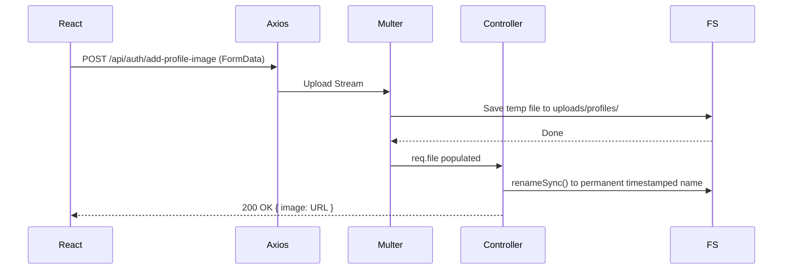
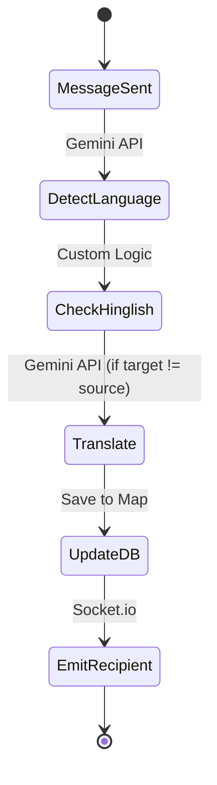

# PolyChat — Project Architecture

> **Single Source of Truth** for the PolyChat MERN real-time multilingual chat application.  
> A new developer should be able to understand the entire system without opening the source code.
> 
> *Related Documents:*
> - [Frontend Documentation](file:///e:/Projects/PolyChat/Docs/FRONTEND_DOCUMENTATION.md)
> - [Backend Documentation](file:///e:/Projects/PolyChat/Docs/BACKEND_DOCUMENTATION.md)
> - [Features and Workflow](file:///e:/Projects/PolyChat/Docs/FEATURES_AND_WORKFLOW.md)

---

## Table of Contents

1. [Project Overview](#1-project-overview)
2. [Architecture Principles](#2-architecture-principles)
3. [Folder Structure](#3-folder-structure)
4. [Frontend Architecture](#4-frontend-architecture)
5. [Backend Architecture](#5-backend-architecture)
6. [Design Decisions](#6-design-decisions)
7. [Authentication Flow](#7-authentication-flow)
8. [Request Flow](#8-request-flow)
9. [Socket Flow](#9-socket-flow)
10. [Image Upload Flow](#10-image-upload-flow)
11. [AI Translation Flow](#11-ai-translation-flow)
12. [Environment Variables](#12-environment-variables)
13. [Third-Party Services](#13-third-party-services)
14. [Future Evolution](#14-future-evolution)
15. [Glossary](#15-glossary)

---

## 1. Project Overview

### Purpose

PolyChat is a **real-time, multilingual group and direct messaging application** built on the MERN stack. Its primary differentiator is **AI-powered automatic message translation**: every Chat Message is transparently translated into each recipient's Preferred Language using the **Gemini 2.5 Flash** model, enabling users who speak different languages to converse naturally without manual translation.

### Features

| Feature | Description |
|---|---|
| **Direct Messages (DMs)** | Instant one-on-one messaging over WebSocket |
| **Channels** | Named group channels with invite/accept/reject workflows |
| **AI Translation** | Messages auto-translated per-recipient using Gemini 2.5 Flash |
| **Hinglish Support** | Smart detection and transliteration of Hindi written in Latin script |
| **Typing Indicators** | Live "user is typing…" for both DMs and Channels |
| **Online Presence** | Real-time green/grey status dot for all Contacts |
| **Read Receipts** | Double-tick style read confirmation for DM messages |
| **File Sharing** | Upload and share files inside any chat |
| **Profile Images** | Upload / remove avatar image, stored on the server |
| **Avatar Colors** | 4 customizable avatar accent colors |
| **Friend System** | Send / accept / reject / remove friend requests |
| **Channel Invites** | Admin invites users; users accept or reject |
| **Dark Mode** | App-wide dark/light toggle, persisted in `localStorage` |
| **Framer Motion** | Smooth page transitions, progress bars, and micro-animations |
| **Emoji Picker** | Inline emoji keyboard for all message inputs |

### Technologies

| Layer | Technologies |
|---|---|
| **Frontend** | React 19, Vite 6, TailwindCSS 3, Zustand 5, Socket.io-client 4, Axios, React Router DOM 7, Framer Motion 12, Lottie React, Radix UI, Sonner, react-icons, moment.js |
| **Backend** | Node.js 18, Express 4, Socket.io 4, Mongoose 8, JWT (jsonwebtoken), bcryptjs, Multer, cookie-parser, cors |
| **Database** | MongoDB Atlas (cloud-hosted) |
| **AI** | Google Gemini 2.5 Flash API |
| **Deployment** | Frontend → Vercel \| Backend → Render.com |

---

## 2. Architecture Principles

- **Separation of Concerns (MVC):** The backend strictly separates routing (Routes), business logic (Controllers), third-party integrations (Services), and data access (Models).
- **State Isolation:** The frontend separates global state (Zustand) from local UI state. API logic is decoupled from React components.
- **Real-time First:** The application prioritizes WebSocket (Socket.io) events for data delivery to ensure low latency. HTTP is reserved for historical data fetching and initial handshakes.
- **Optimistic UI:** When a user sends a message, it is instantly rendered on their screen before the server acknowledges it, ensuring a snappy user experience.
- **Graceful Degradation:** If the Gemini API fails or rate-limits, the system falls back to delivering the original untranslated text rather than dropping the message entirely.
- **Security First:** JWTs are stored in secure cookies (not local storage) to mitigate XSS. Passwords are salted and hashed via bcryptjs.

---

## 3. Folder Structure

```text
PolyChat/
├── Docs/                            # Official project documentation
├── client/                          # React + Vite frontend SPA
│   ├── src/
│   │   ├── components/              # Shared UI components (Radix/shadcn)
│   │   ├── context/                 # React Context (SocketContext)
│   │   ├── lib/                     # API client & utils
│   │   ├── Pages/                   # Route-level views (Auth, Profile, Chat)
│   │   ├── store/                   # Zustand state slices
│   │   └── utils/                   # Constants and static data
├── server/                          # Express + Socket.io backend
│   ├── controllers/                 # Business logic
│   ├── middlewares/                 # JWT verification
│   ├── models/                      # Mongoose schemas
│   ├── routes/                      # API endpoint definitions
│   ├── services/                    # Gemini translation service
│   └── uploads/                     # Local file storage (Avatars, Attachments)
```

> **Developer Note:** For a deeper dive into the folder structures, see [FRONTEND_DOCUMENTATION.md](file:///e:/Projects/PolyChat/Docs/FRONTEND_DOCUMENTATION.md) and [BACKEND_DOCUMENTATION.md](file:///e:/Projects/PolyChat/Docs/BACKEND_DOCUMENTATION.md).

---

## 4. Frontend Architecture

The frontend is a Vite-powered React SPA utilizing React Router DOM for navigation and Zustand for global state management.

### Key Workflows
- **Routing Guards:** `<PrivateRoute>` and `<AuthRoute>` prevent unauthorized access based on the presence of `userInfo` in Zustand.
- **State Slices:** `auth-slice.js` manages the user session, while `chat-slice.js` handles messages, Channels, Contacts, typing indicators, and UI themes.
- **Socket Context:** `Socketcontext.jsx` initializes the WebSocket connection and binds all incoming real-time events (`receiveMessage`, `user-typing`) to Zustand store updates.

> **See Also:** [02_FRONTEND_DOCUMENTATION.md](file:///e:/Projects/PolyChat/Docs/FRONTEND_DOCUMENTATION.md) for component breakdowns and state tables.

---

## 5. Backend Architecture

The backend is an Express server running in tandem with a Socket.io instance on the same port. 

### Key Modules
- **Controllers & Routes:** Modularized into Auth, Contacts, Messages, and Channel domains.
- **Models:** MongoDB schemas utilizing advanced features like `Map` for translations and `pre('save')` hooks for password hashing.
- **Translation Service:** Encapsulates Gemini API logic, handling language detection, Hinglish overrides, and API quota tracking.

> **See Also:** [03_BACKEND_DOCUMENTATION.md](file:///e:/Projects/PolyChat/Docs/BACKEND_DOCUMENTATION.md) for the database schema and Express request lifecycle.

---

## 6. Design Decisions

### Why Zustand instead of Redux?
Zustand provides a leaner, boilerplate-free approach to global state. It doesn't require wrapping the application in a Context Provider and allows for direct state mutations that are incredibly performant for high-frequency updates like typing indicators.

### Why JWT Cookies instead of LocalStorage?
Storing JWTs in `localStorage` makes them susceptible to Cross-Site Scripting (XSS) attacks. Using an HTTP cookie with `Secure` and `SameSite=None` attributes ensures the browser automatically attaches the token to API requests safely across domains (Vercel to Render).

### Why a MongoDB Map for Translations?
Instead of a rigid schema (`translated_en`, `translated_es`), a Mongoose `Map` allows dynamic ISO language codes as keys. This means PolyChat can easily add support for 50 new languages tomorrow without altering the database schema.

### Why Socket.io instead of raw WebSockets?
Socket.io provides essential out-of-the-box features: automatic reconnections, connection multiplexing (rooms/channels), and fallback polling for restrictive corporate networks.

---

## 7. Authentication Flow

See [FEATURES_AND_WORKFLOW.md - Authentication](file:///e:/Projects/PolyChat/Docs/FEATURES_AND_WORKFLOW.md#1-authentication-register-login-logout) for the detailed sequence diagram.

**JWT Cookie properties:**
- `secure: true` — HTTPS only (important for cross-origin production deployment).
- `sameSite: "None"` — required for cross-origin cookies.
- `maxAge: 3d` — 3 days in milliseconds.

---

## 8. Request Flow

```mermaid
flowchart TD
    Browser[Browser / User Interaction] --> React[React Component]
    React --> Zustand[Zustand Store (State prep)]
    Zustand --> Axios[Axios API Client]
    Axios -->|HTTP POST with Cookie| Express[Express Router]
    
    subgraph Backend
        Express --> Auth[AuthMiddleware]
        Auth --> Controller[Controller Logic]
        Controller --> Service[Service Layer]
        Service --> MongoDB[(MongoDB)]
    end
    
    MongoDB --> Controller
    Controller --> Express
    Express --> Axios
    Axios --> Zustand
    Zustand --> React
    React --> Browser
```

---

## 9. Socket Flow

> **Developer Note:** Real-time events are the backbone of PolyChat. Always emit `sendMessage` over Socket.io, *never* via an HTTP POST, to ensure instant delivery.

See [FEATURES_AND_WORKFLOW.md - One-to-One Chat](file:///e:/Projects/PolyChat/Docs/FEATURES_AND_WORKFLOW.md#4-one-to-one-chat-text--image-messages) for detailed Socket sequence diagrams.

---

## 10. Image Upload Flow



---

## 11. AI Translation Flow

> **Developer Note:** The translation happens asynchronously *after* the message is saved to the database to ensure the sender doesn't experience API latency.



---

## 12. Environment Variables

> **Developer Note:** Ensure these are configured identically across development and production environments.

| Variable | Scope | Description |
|---|---|---|
| `VITE_SERVER_URL` | Frontend | URL of the backend (e.g., `http://localhost:8747`) |
| `PORT` | Backend | Execution port |
| `JWT_KEY` | Backend | Secret used to sign JWT tokens |
| `ORIGIN` | Backend | Allowed CORS origin (Frontend URL) |
| `DATABASE_URL`| Backend | MongoDB Atlas connection string |
| `GEMINI_API_KEY` | Backend | Google AI Studio Key |

---

## 13. Third-Party Services

| Service / Lib | Usage in PolyChat |
|---|---|
| **Lottie React** | Renders lightweight, scalable vector animations (JSON) on the Auth page and Empty Chat states. |
| **Framer Motion** | Orchestrates layout transitions, file upload progress bars, and modal popups. |
| **Multer** | Middleware for handling `multipart/form-data`, specifically used for Avatar and Attachment file uploads. |
| **Radix UI** | Provides headless, accessible UI primitives (dropdowns, dialogs, scroll areas) wrapped by shadcn/ui. |
| **Sonner** | Toast notification system for displaying API errors and success messages. |

---

## 14. Future Evolution

To evolve PolyChat into an enterprise-grade platform, the following architectural improvements should be considered:

- **Horizontal Scaling & Redis:** The current `userSocketMap` is strictly in-memory. Deploying a `socket.io-redis` adapter will allow the backend to scale across multiple Node.js instances.
- **CDN & Cloud Storage:** Migrate Multer local file uploads to Amazon S3 or Cloudinary, served via a CDN, to ensure files persist across server restarts (crucial for PaaS like Render).
- **Database Indexing:** Add compound indexes on `MessagesModel` (`sender`, `recipient`, `timestamp`) to speed up query times as the message history grows.
- **Message Queuing:** Implement RabbitMQ or Kafka for the AI Translation service to handle massive bursts of messages without overwhelming the Gemini API or dropping translations on timeout.

---

## 15. Glossary

| Term | Definition |
|---|---|
| **Channel** | A multi-user chat room with a defined name, admin, and member list. |
| **Direct Message (DM)** | A private one-to-one conversation between two users. |
| **Chat Message** | A single unit of communication (text or file) sent within a DM or Channel. |
| **AI Translation** | The process of automatically converting a Chat Message into the recipient's Preferred Language using the Gemini API. |
| **Preferred Language** | The ISO 639-1 language code selected by a user during Profile Setup. |
| **Contact** | Any user in the system that can be searched or messaged. |
| **Friend** | A Contact who has mutually accepted a friend request. |
| **Optimistic Update** | Updating the frontend UI immediately before receiving confirmation from the server (e.g., displaying a sent message instantly). |
| **Read Receipt** | The double-tick UI indicator confirming the recipient has opened the chat. |
| **JWT** | JSON Web Token; the cryptographic string used to maintain user sessions. |
| **Translation Map** | The MongoDB data structure (`translatedContent`) storing multiple localized versions of a single Chat Message. |
